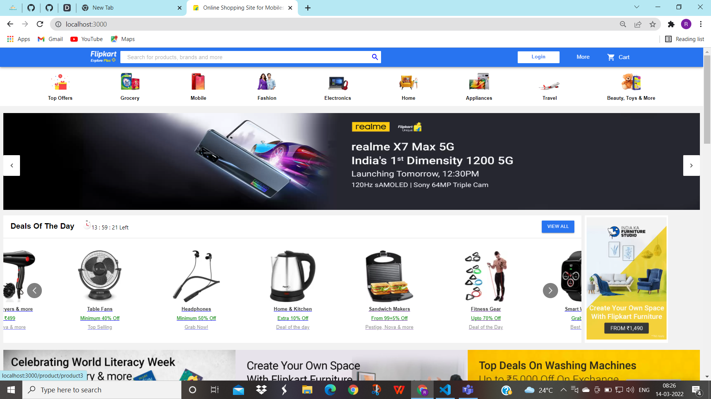
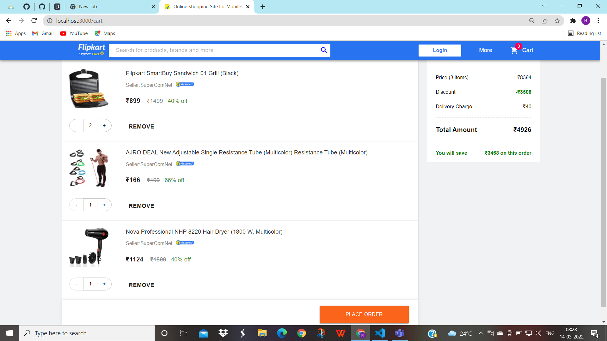
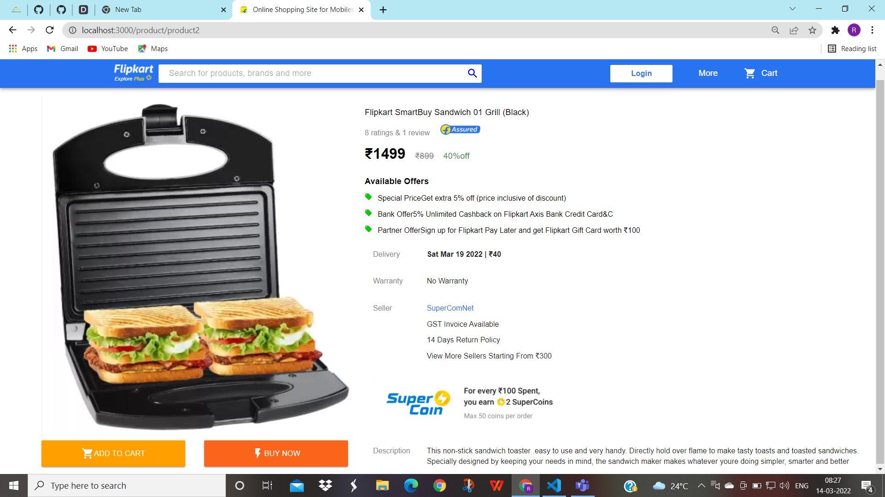
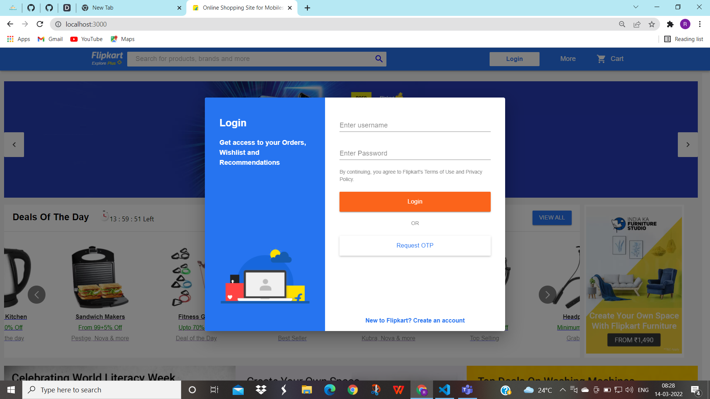
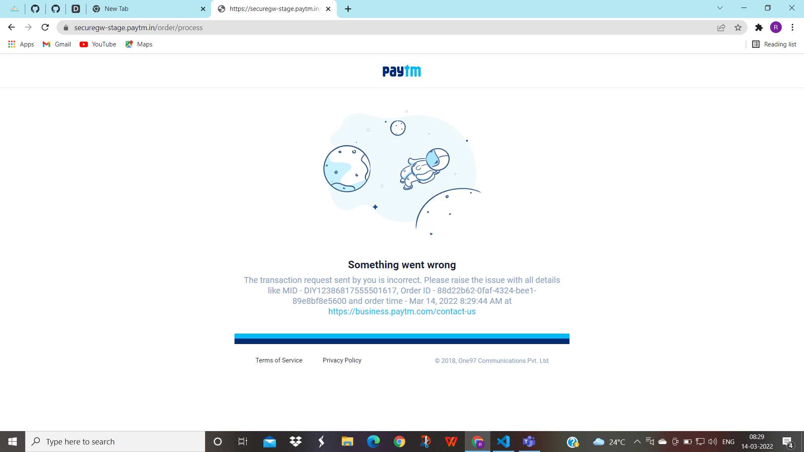

# Flipkart clone
`Flipkart clone` is a MERN stack web app inspired from flipkart. Responsive.

## Tech Stack
MERN stack 
Material UI 
Redux

## Features
- [x] User can shop with or without signup/signin (if signed in username shows up. there is logout option too )
- [x] Product data fetched from database is shown in slidebar. User can search for a particular product
- [x] Product can be clicked and added to cart or buy now. (quantity can be increased/decreased in cart page)
- [x] Place order will redirect to PAYTM payment gateway(dummy, this can show error page if merchant id is expired)

## Demo images
### Home page -

 
 

### Cart page -

 
 

### Item page -

 
 

### Login page -

 
 

### payment page -
 
in case merchant id is expired you may get this page

 
 
